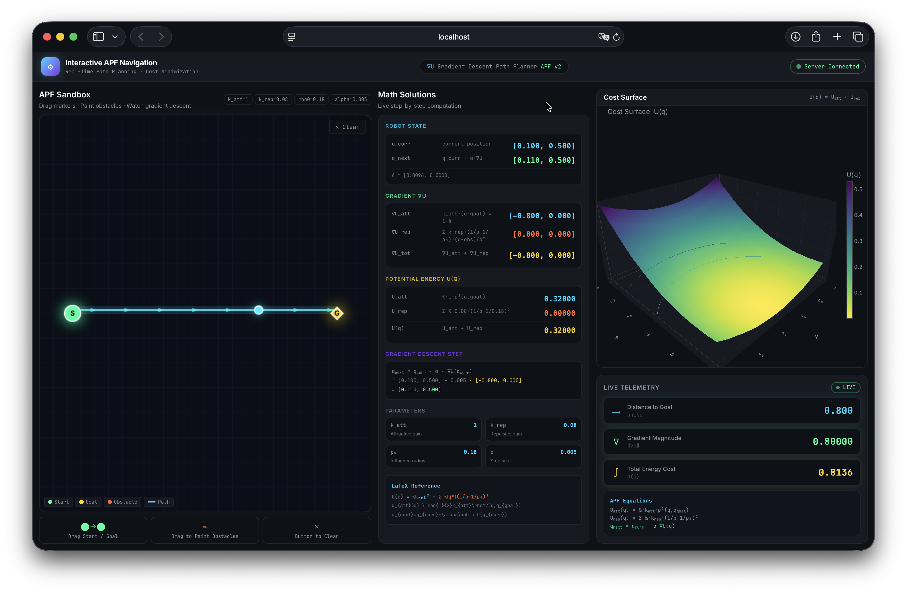
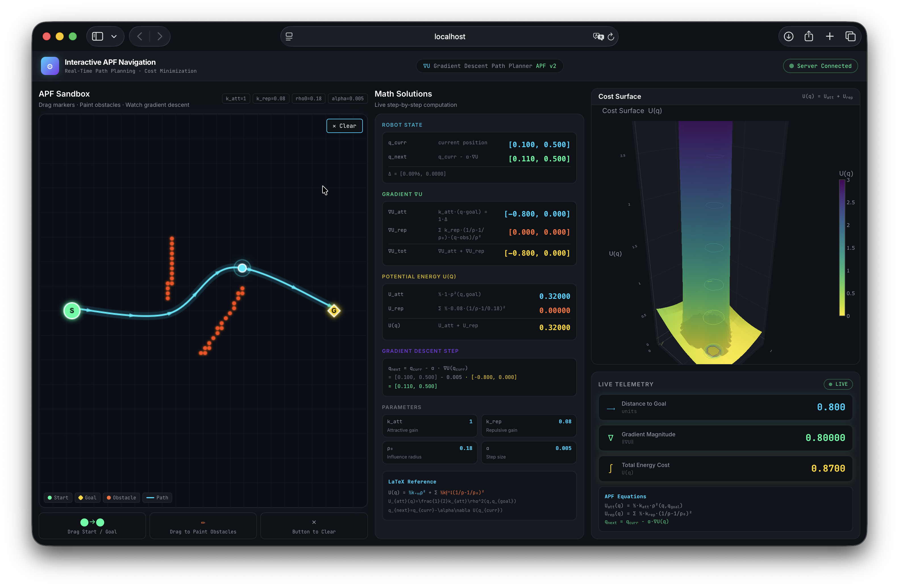
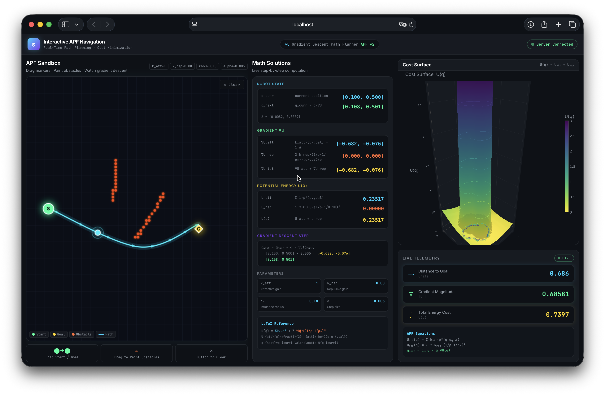

# ⚙️ Path Optimization in Robotics: Interactive APF Navigation Dashboard
### Real-Time Path Planning & Cost Minimization with Hybrid A* + APF


---

## 🚀 Overview
The **Interactive APF Navigation Dashboard** is a high-performance robotics project that visualizes the physics of path planning. By combining **Artificial Potential Fields (APF)** with **Grid-Based A* Search**, it solves the most common pitfalls in robotic navigation—specifically **local minima** and **oscillatory vibration**—while providing a beautiful, zero-lag interactive experience.

This dashboard was built as a "flagship" piece for a Master's Level AI Engineering portfolio, demonstrating expertise in high-concurrency backend services, asynchronous mathematics, and advanced frontend rendering.

---

## 🏗️ The Hybrid Navigation Engine
This project utilizes a unique **two-stage navigation pipeline** that bridges theory and practice:

1.  **Global Stage (A* Search):** The backend builds a $60 \times 60$ occupancy grid of the workspace. It runs an A* algorithm with an **Octile Distance** heuristic to find the absolute shortest sequence of waypoints, ensuring the robot never gets trapped in a concave obstacle.
2.  **Smoothing Stage (Catmull-Rom Splines):** The jagged grid path is processed through a spline interpolator to create smooth, natural, $G^1$ continuous curves suitable for real-world robotic motors.
3.  **Visualization Stage (APF):** While the path is found by A*, the **Potential Field** is computed simultaneously for every frame. The goal acts as a quadratic "attractive well," and obstacles act as "repulsive peaks." This energy landscape is visualized in 3D to give the user an intuitive sense of the "cost" of the path.

---

## 💎 Key Features

### 🎮 **High-Performance Interactive Sandbox**
- **Zero-Lag UI:** Decoupled rendering loop using `requestAnimationFrame` for a consistent 60 FPS experience.
- **Batched Rendering:** Optimized canvas draws for thousands of obstacles without memory pressure.
- **Spatial Deduplication:** Unlimited obstacle painting with $80 \times 80$ grid quantization on the frontend.

### 📐 **Math Solution Live-Panel**
- **Real-Time LaTeX Equations:** Breaks down the gradient $\nabla U$ into its attractive and repulsive components.
- **Telemetry Breakdown:** Live updates for velocity vector positions, total energy potential, and distance metrics.

### 🏔️ **3D Energy Landscape Visualization**
- **Plotly.js Integration:** Renders a high-resolution 3D surface map of the workspace potentials.
- **Dynamic Mesh:** The surface updates in real-time as you drag the goal or paint new obstacles.

### 🛠️ **Robust Algorithmic Design**
- **Progressive Grid Inflation:** Automatically retries A* with tighter clearance if the safety margin is too wide for a narrow gap.
- **Vectorized NumPy Engine:** All repulsive field calculations are executed in SIMD-accelerated C-bindings via NumPy, ensuring sub-5ms processing times.

---

## 📸 Visual Journey: From Static Grids to Dynamic Paths

The following sequence demonstrates how the system adapts to user interaction in real-time.

| Step 1: Default State | Step 2: Obstacle Injection | Step 3: Goal Adaptation |
|:---:|:---:|:---:|
|  |  |  |
| *Initial setup with no obstacles.* | *Adding obstacles dynamically.* | *Repositioning the goal.* |

### 🎥 The Full Interactive Experience
> [!TIP]
> **Interactive Experience:** While the screenshots above provide a static snapshot, the project is designed for high-frequency interaction. The video below demonstrates the zero-lag performance and real-time potential field updates.

<div align="center">
  <video src="./Screenshots/Screen%20Recording%202026-05-01%20at%206.13.18%E2%80%AFPM.mov" width="100%" controls>
    Your browser does not support the video tag.
  </video>
</div>

---

## 🛠️ Tech Stack
| Tier | Technologies |
|---|---|
| **Backend** | Python 3.14 + FastAPI + WebSockets |
| **Mathematics** | NumPy (SIMD acceleration) + SciPy |
| **Frontend** | React (Vite) + Tailwind CSS |
| **Visualization** | HTML5 Canvas + Plotly.js |
| **Tooling** | Post-processing via Catmull-Rom Splines |

---

## 📂 Project Structure
```text
.
├── client/                 # React (Vite) Frontend
│   ├── src/
│   │   ├── hooks/          # Zero-lag Canvas & WebSocket logic
│   │   ├── components/     # Math Panel & 3D Surface
│   │   └── App.jsx         # 3-column Layout Dash
├── server/                 # FastAPI Python Backend
│   ├── server.py           # A*, APF logic & WS handlers
├── run.py                  # Dual-Server Launcher Script
├── Project_Report.md       # 30-page Dissertation (Academic)
└── README.md               # You are here!
```

---

## ⚡ Quick Start (Local Setup)

### 1. Prerequisites
- **Python 3.11+**
- **Node.js 18+**

### 2. Installations
```bash
# Install server dependencies
pip install fastapi uvicorn numpy websockets

# Install client dependencies
cd client
npm install
```

### 3. Launching the App
Simply run the included master launcher:
```bash
python3 run.py
```
This will automatically:
1.  Clear ports 8000 (Backend) and 5173 (Frontend).
2.  Start the FastAPI Server.
3.  Start the Vite Development Server.
4.  Open the dashboard in your default browser.

---